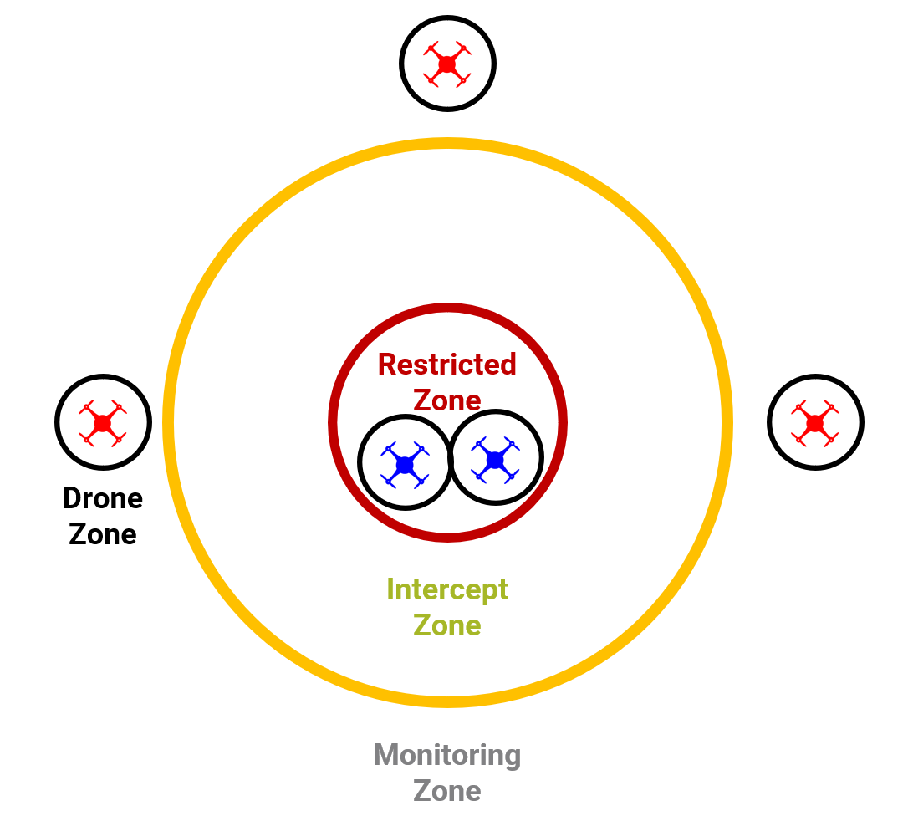

# Smart Drones

Investigates the problem of area defense using drones. Using multi-agent reinforcement learning (MARL), we pit a team of collaborative drones tasked to defend an area against an attacking opposing team of drones. To develop such systems, we present the Multi-Agent Deep Deterministic Policy Gradient Version 2 (MADDPGv2) algorithm, which incorporates state-of-the-art features from Graph Neural Networks (GNN) such as the Graph Attention Network Version 2 (GATv2) and Graph Multiset Transformer (GMT) with Hindsight Experience Replay (HER) to the original MADDPG algorithm. Our studies highlight the strong performance of MADDPGv2 over vanilla approaches, showcasing its ability to provide better and more scalable state representations while overcoming significantly sparse rewards specific to the area defence problem. Additional scenarios implemented on the Multi-Agent Particle Environment used in the paper [Multi-Agent Actor-Critic for Mixed Cooperative-Competitive Environments](https://arxiv.org/pdf/1706.02275.pdf).

Environments in this repo:
<pre>
@article{lowe2017multi,
  title={Multi-Agent Actor-Critic for Mixed Cooperative-Competitive Environments},
  author={Lowe, Ryan and Wu, Yi and Tamar, Aviv and Harb, Jean and Abbeel, Pieter and Mordatch, Igor},
  journal={Neural Information Processing Systems (NIPS)},
  year={2017}
}
</pre>

Original particle world environment:
<pre>
@article{mordatch2017emergence,
  title={Emergence of Grounded Compositional Language in Multi-Agent Populations},
  author={Mordatch, Igor and Abbeel, Pieter},
  journal={arXiv preprint arXiv:1703.04908},
  year={2017}
}
</pre>

## Problem Statement

There are two variants of the problem statement: **zone\_def\_push** and **zone\_def\_tag**. For both variants, there are $x$ blue drones and $y$ red drones in the training environment and three zones: monitoring, intercept and restricted zones, as illustrated above. The objective of the blue drones is to keep the red drones away from the restricted zone by a specified time limit, while the objective of the red drones is to infiltrate the restricted zone. The environment randomly spawns the blue drones in the restricted zone and red drones in the monitoring zone. In addition, potential landmarks can be spawned randomly between the restricted and intercept zones.

Each drone is assumed to have a computer vision system that provides obstacle detection with depth perception, translating to a drone zone where the drone is perceptive of its local surroundings. Furthermore, the environment has a radar that works for the blue drones that detect all entities (e.g. opponents and landmarks) with a specified radar noise. Both blue and red drones also know their teammates’ specific kinematic states (e.g. position and velocity). If a drone’s teammates are in its drone zone, the drone receives information with no noise under the assumption of a perfect drone vision system. Else, information received would include a specified noise. For **zone\_def\_tag**, blue drones can disable red drones by colliding with them. A disabled drone cannot move at all (like a landmark) and cannot communicate. The blue drones in **zone\_def\_push** do not have that ability and are expected to push the red drones away from the restricted zone.